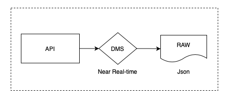
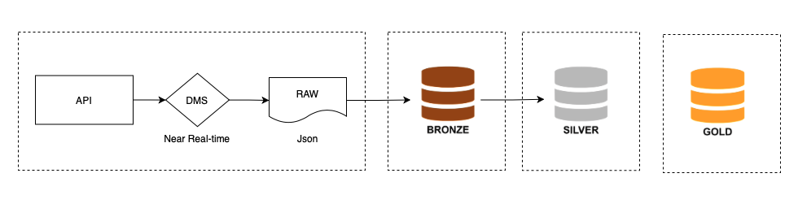

# Desafio de Engenharia de Dados - Coco Bambu 2024

## Objetivo

Fui desafiado a modelar e processar dados provenientes de APIs de um ERP de restaurante, armazenando-os de forma estruturada para facilitar análises. O primeiro desafio envolvia a transformação de dados JSON em tabelas SQL, enquanto o segundo focava no armazenamento eficiente dessas respostas no Data Lake.

Para resolver esse problema, optei pela arquitetura Medalhão, que organiza o processamento de dados em camadas Bronze e Silver. A camada Bronze armazena os dados brutos, enquanto a camada Silver contém os dados já transformados e mais estruturados para análise. Escolhi essa abordagem com a premissa de que, diariamente, são coletados dados de todas as unidades da rede de restaurantes, abrangendo todos os clientes atendidos no dia. A arquitetura foi selecionada pela sua escalabilidade e flexibilidade, permitindo uma transformação gradual dos dados.

## Observações

1. Para a realização deste projeto, presumi que os dados da empresa passassem por um processo no sistema de gerenciamento de dados (DMS), que faz a requisição à API e disponibilizava os dados em formato JSON na camada raw do Data Lake, conforme o diagrama a seguir.

2 .Para essa solução não implementei a aquirtetura medalhão fim a fim, mas sim uma solução mais simplificada para uso localmente.

## Logica

- A solução foi implementada localmente com o uso do Apache Spark para processamento em massa e SQLite para armazenamento local.
- O processo foi orquestrado com uma lógica que garante a continuidade entre as camadas e facilita o carregamento dos dados para uso posterior.

- **Camada Bronze**: A ingestão dos dados brutos, em formato JSON, é realizada para uma tabela "Delta do Spark", que é representada por arquivo Parquet no seguite caminho: **DataLake/landing-zone/bronze/erp/erp_dataatual**. Presume-se que, diariamente, haverá um arquivo JSON na camada Raw. O Spark processa esse arquivo e o armazena em Parquet na camada Bronze, renomeando-o com a data do dia.
  
- **Camada Silver**: Os dados da camada Bronze são processados e transformados para um formato mais estruturado, pronto para análise. Na Silver, os dados são refinados e organizados em tabelas SQL para fácil consulta.

## Documentação do Processo

## **Descrição Geral**
Este pipeline é responsável por processar dados do ERP em camadas do Data Lake e armazená-los também em um banco de dados SQLite. Ele organiza os dados nas camadas **Bronze** e **Prata**, otimizando a estrutura para análises e gerando um banco relacional local para consultas rápidas.

### **Bronzer**
A camada Bronze ingere dados brutos da camada **Raw**, adiciona metadados básicos e armazena no formato **Parquet**.

### **Silver**
A camada Prata transforma e desnormaliza os dados estruturados da Bronze, organizando-os em tabelas específicas (e.g., `guest_checks`, `menu_items`).

### **SQLite Database**
Os dados da camada Prata são carregados e populados em um banco SQLite (`erp_database.db`), permitindo consultas relacionais em um ambiente local.

---

## **Origem do Processo**
Os dados processados vêm de arquivos JSON disponiveis na Raw, seguindo este fluxo:
1. **Raw:** Dados brutos em JSON.
2. **Bronze:** Dados estruturados, enriquecidos e armazenados em Parquet.
3. **Prata:** Dados desnormalizados e particionados em tabelas temáticas.
4. **SQLite:** Banco relacional local com tabelas materializadas da Prata.

---

## **Descrição do Processamento**

### **Bronze Layer**
- **Arquivo:** `bronze.py`
- **Descrição:**
  1. **Leitura dos Dados Brutos:**  
     Lê arquivos JSON da camada Raw e converte para DataFrame PySpark.
  2. **Adição de Metadados:**  
     Adiciona a coluna `ingestion_date`.
  3. **Armazenamento:**  
     Salva os dados no formato Parquet no diretório `DataLake/landing-zone/Bronze/erp`.
  4. **Exclusão do Arquivo Original:**  
     Remove o JSON original para evitar duplicação.
  5. **Gerenciamento do Database:**  
     Cria o database `DB_ERP` para tabelas da Bronze.

---

### **Silver Layer**
- **Arquivo:** `silver.py`
- **Descrição:**
  1. **Leitura dos Dados Bronze:**  
     Lê os arquivos Parquet processados na camada Bronze.
  2. **Transformação dos Dados:**  
     Desnormaliza os dados em tabelas específicas:
     - **`guest_checks`**: Detalhes gerais dos checks.
     - **`menu_items`**: Itens do menu vinculados.
     - **`taxes`**: Informações de impostos.
     - **`detail_lines`**: Linhas detalhadas de cada check.
  3. **Armazenamento:**  
     Salva as tabelas no formato Parquet em `DataLake/landing-zone/Prata/erp`.
  4. **Gerenciamento do Database:**  
     Cria o database `DB_ERP_SILVER` para gerenciar tabelas da Prata.

---

### **SQLite Database**
- **Arquivo:** `main.py`
- **Descrição:**
  1. **Criação do Banco SQLite:**  
     Cria o arquivo `erp_database.db` para armazenar as tabelas da camada Prata.
  2. **Leitura dos Dados Prata:**  
     Lê as tabelas da Prata no formato Parquet.
  3. **Materialização no SQLite:**  
     Para cada tabela (`menu_items`, `guest_checks`, `taxes`, `detail_lines`):
     - Cria a estrutura relacional no SQLite com base no esquema das tabelas.
     - Insere os dados extraídos da camada Prata.
  4. **Finalização:**  
     Fecha a conexão e confirma o sucesso da operação.

---

### **Fluxo do Processamento**
1. **Configuração:**  
   Configuração do sistema de logging para rastreamento.
2. **Execução Bronze:**  
   - Criação do database Bronze.
   - Processamento dos dados brutos em JSON.
3. **Execução Silver:**  
   - Criação do database Silver.
   - Transformação e particionamento dos dados da Bronze.
4. **Criação do Banco SQLite:**  
   - Carregamento dos dados da Prata.
   - Inserção no banco relacional SQLite.

---

## **Destino do Processo**
Os dados processados são organizados e armazenados em:

1. **Camada Bronze:**  
   - Local: `DataLake/landing-zone/Bronze/erp/erp_YYYYMMDD`.
   - Formato: Parquet.
2. **Camada Prata:**  
   - Local: `DataLake/landing-zone/Prata/erp/<nome_da_tabela>`.
   - Tabelas: `menu_items`, `guest_checks`, `taxes`, `detail_lines`.
   - Formato: Parquet.
3. **Banco SQLite:**  
   - Arquivo: `erp_database.db`.
   - Tabelas: `menu_items`, `guest_checks`, `taxes`, `detail_lines`.

---

## **Objetivo Geral**
Este processo organiza os dados para facilitar:
- **Análises avançadas:** com tabelas estruturadas.
- **Consultas rápidas:** através do banco SQLite.
- **Eficiência e consistência:** com armazenamento otimizado no formato Parquet.

---
